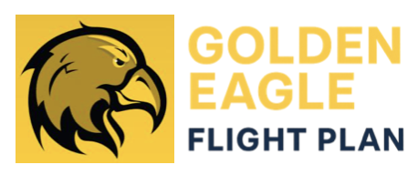

# CSULA Senior Design Project

## ✨ Objective
The project aims to support student success by providing a comprehensive platform that addresses three key areas: **Academic Preparation**, **Career Development**, and **Leadership & Community Engagement**. Our goal is to create a dynamic, evidence-based system that guides students through their academic journey and prepares them for life after graduation.

---

## 🎯 Core Goals

* **Support Degree Completion ✅**: Offer personalized academic planning and guidance by connecting students with essential campus resources like advisors, tutors, food pantries, and financial aid offices.
* **Expose Advanced Opportunities 🚀**: Actively connect students to advanced opportunities, including research projects, internships, and competitions that align with their interests.
* **Career-Readiness Plan 💼**: Provide tailored recommendations for career skills and professional experiences based on the student's academic progress and goals.
* **Time Management ⏳**: Assist students in developing balanced schedules that incorporate study, rest, and recreation for overall well-being.
* **Evidence-Based Suggestions 📊**: Ensure all recommendations are supported by verifiable sources, such as university catalog rules, advisor input, and official campus/career resource sites.

---

## 🚀 Core Features

* **Student Profile Intake 📝**: A user-friendly interface for students to input their completed courses, career interests, and personal constraints (e.g., work hours, ADA requirements).
* **Opportunity Finder 🔍**: An intelligent system that recommends relevant research projects, internships, student clubs, and leadership activities based on the student's profile.
* **Plan Tracker 📈**: A dashboard that provides customized recommendations in three main areas: Academic Preparation, Career Development, and Leadership/Community Engagement.
* **Career ↔ Course Outcome Matching 🔗**: A feature that matches course learning outcomes and activities to specific job skills and career pathways.
* **University Rules Engine 🏛️**: A backend system that encodes key university policies (e.g., withdrawal, graduation requirements, financial aid limits) to provide proactive guidance and prevent students from getting off track.
* **Faculty/Advisor Opportunity Input 🧑‍🏫**: A simple interface for faculty and advisors to submit new opportunities for students, including a title, description, expiration date, and learning outcomes.
* **Student Support Services Integration ❤️**: Integration with various campus resources like tutoring centers, advising centers, and food pantries, linking them to a student's specific needs and major.
* **Advisor Dashboard 📊**: A dedicated view for advisors to monitor student profiles, track their progress, and provide comments or make adjustments to their plans.

---

## 💡 Other Considerations

* **Data Privacy 🔒**: Protecting student data is a top priority, and all platform features must comply with FERPA standards.
* **Explainability 🧐**: All AI-powered recommendations must be transparent, citing the specific rules, policies, or source documents used to generate the suggestion.
* **Scalability 🌐**: The platform should be designed to support multiple majors and departments across the entire campus.

---

## 🧑‍🤝‍🧑 Team Members

* Jayson Alfaro-Trujillo
* Rana Ashour
* Jose Mateo Ayala
* Jael Estrada
* Kenny Jiang
* Brandon Jou
* Arman Mahmoodzadeh
* Jose Oscanoa
* Perla Reyes-Ortega
* Adan Trejo

---

## 🛠️ Core Technology Stack

### 1. Node.js

* **What it is:** The JavaScript runtime environment. This is the absolute foundation for both our backend and frontend development, so it must be installed first.
* **How to get it:** Download and install the **LTS (Long-Term Support)** version from the official website.
* **Link:** **[https://nodejs.org/en/download](https://nodejs.org/en/download)**

### 2. MongoDB

* **What it is:** Our project's database, used to store all application data like user profiles and course information.
* **How to get it:** Download and install the free **Community Server** edition for the team's respective operating systems (Mac/Windows).
* **Link:** **[https://www.mongodb.com/try/download/community](https://www.mongodb.com/try/download/community)**

### 3. Express.js

* **What it is:** A framework that runs on Node.js to help us build our backend server and API.
* **How to get it:** Express is **not** a standalone program. It is a package that we add to our backend project using a command in the terminal.
* **Command:** `npm install express`

### 4. React Native

* **What it is:** The framework we will use to build our mobile app for the frontend.
* **How to get it:** Similar to Express, React Native is **not** a standalone program. We will use the `npx` command (which comes with Node.js) to create our frontend project. We will be using the Expo framework to make this easier.
* **Command:** `npx create-expo-app <Our-App-Name-Here>`

## 🏁 Getting Started

To be determined

